# Snapory 📸

> **The Premium AI Event Photo Platform**  
> *Instant delivery. Zero friction. Pure magic.*


Snapory redefines event photography by allowing guests to instantly find and download their photos just by scanning a QR code and taking a selfie. No app downloads, no scrolling through thousands of images—just their memories, delivered in seconds via AI face matching.

---

## ✨ Features

- **🚀 Instant Delivery**: Photos are processed and available seconds after upload.
- **🤖 AI Face Matching**: State-of-the-art face recognition (99.9% accuracy) automatically sorts photos by person.
- **📱 Zero App Required**: Guests access their gallery via a simple QR code in their mobile browser.
- **🎨 Premium UI**: A beautiful, glassmorphism-based interface designed for high-end events.
- **🔒 Privacy First**: Secure, pre-signed URLs ensure photos are private and ephemeral.
- **☁️ Cloud Native**: Built on OVH S3 Object Storage for unlimited scalability and low cost.

---

## 🏗️ Architecture

Snapory uses a modern microservices architecture to ensure scalability and separation of concerns.

```mermaid
graph TD
    User[📱 User Mobile] -->|Next.js| Frontend[🎨 Frontend App]
    Frontend -->|REST API| Backend[⚙️ .NET 8 Backend]
    Backend -->|Uploads| S3[☁️ OVH Object Storage]
    Backend -->|Job Queue| Redis[⚡ Redis Cache]
    Redis -->|Process Job| AIService[🧠 Python AI Service]
    AIService -->|Face Data| Backend
    Backend -->|Metadata| SQLite[(🗄️ SQLite DB)]
```



---

## 🛠️ Tech Stack

### **Frontend** (Consumer Experience)
- **Framework**: Next.js 14 (App Router)
- **Styling**: Vanilla CSS Variables + Premium "Midnight Purple" Theme
- **State**: React Context API
- **Language**: TypeScript

### **Backend** (Core Logic)
- **Framework**: ASP.NET Core 8.0 Web API
- **Database**: SQLite (Metadata) + Entity Framework Core
- **Storage**: AWS SDK (compatible with OVH S3)

### **AI Service** (Intelligence)
- **Framework**: FastAPI (Python 3.11)
- **Libraries**: `face_recognition`, `dlib`, `numpy`
- **Processing**: Async job processing via Redis

---

## 🚀 Quick Start

### Prerequisites
- **Docker** & **Docker Compose**
- **Git**

### 1. Clone & Config
```bash
git clone https://github.com/karthikurao/Snapory.git
cd Snapory

# Create your secret configuration
cp .env.example .env
```

### 2. Configure Secrets (Critical)
Open `.env` (or `src/SnaporyIngest/appsettings.json`) and add your cloud credentials.  
*Note: The app uses placeholders by default. You MUST update these for uploads to work.*

```json
"S3": {
  "AccessKey": "YOUR_OVH_ACCESS_KEY",
  "SecretKey": "YOUR_OVH_SECRET_KEY"
}
```

### 3. Run Everything (Docker)
```bash
docker-compose up --build
```
> **Access Points:**
> - Frontend: `http://localhost:3000`
> - Backend: `http://localhost:5000`
> - AI Service: `http://localhost:8000`

---

## 🧑‍💻 Manual Development Setup

If you prefer running services individually for debugging:

**1. AI Service (Python)**
```bash
cd ai-service
pip install -r requirements.txt
uvicorn app.main:app --port 8000
```

**2. Backend (.NET)**
```bash
cd src/SnaporyIngest
dotnet restore
dotnet run
```

**3. Frontend (Node)**
```bash
cd frontend
npm install
npm run dev
```

---

## 🧪 Verification

We include scripts to verify the system health and flow:

- **`verify_background.py`**: Tests the background processing service by injecting a mock job into the DB.
- **`app/api-client.ts`**: The frontend client is fully typed and ready for integration testing.

---

## 🛣️ Roadmap

- [x] Core Upload & Face Detection
- [x] Guest QR & Selfie Flow
- [x] Premium UI Overhaul
- [ ] Payment Gateway Integration (Stripe/Razorpay)
- [ ] Email/WhatsApp Notifications
- [ ] Multi-tenant Photographer Dashboard

---

## 📄 License

This project is licensed under the MIT License - see the [LICENSE](LICENSE) file for details.

---

<p align="center">
  Built with ❤️ for memories that last forever.
</p>
